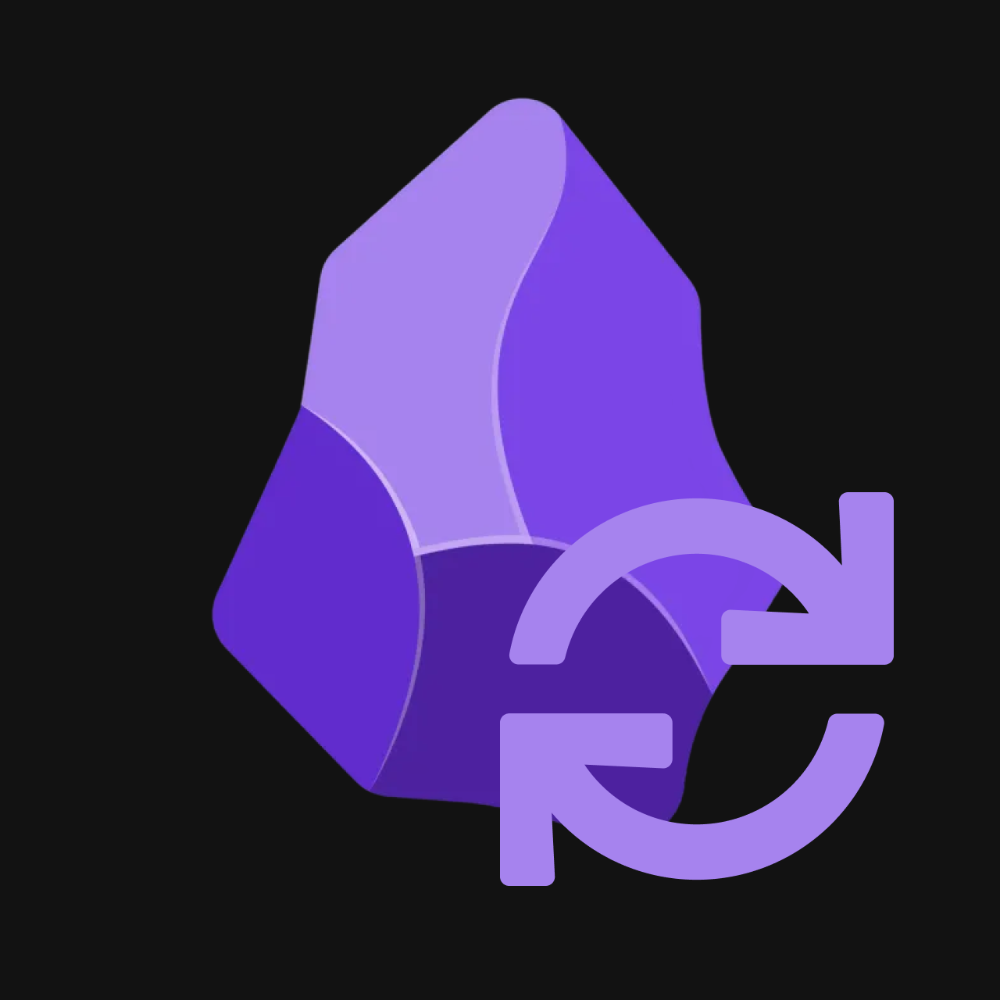

<p align="center">
  
</p>

# SuperSync

<p align="center">
  <a href="obsidian://show-plugin?id=supersync">
    
  </a>
</p>

<p align="center">
  
  &nbsp;&nbsp;•&nbsp;&nbsp;
  <em>Developed by Rahuletto</em>
</p>

**SuperSync** is a lightweight, unified, and secure Obsidian plugin designed to synchronize your Obsidian vaults directly with a **private GitHub repository** using the GitHub REST and Git Data APIs.

Unlike traditional git-based plugins, SuperSync **does not require a local Git installation** or command-line dependencies. It works seamlessly out-of-the-box across **both desktop and mobile platforms** (iOS & Android).

---

## ✨ Features

* **📱 Cross-Platform Compatibility**: Syncs your vault on iOS, Android, macOS, Windows, and Linux without needing native Git clients.
* **🔑 Zero-Password Security**: Log in securely using GitHub's official **Device Authorization Flow**. Enter a simple code in your browser—no Personal Access Token copy-pasting required.
* **🛡️ Conflict Prevention (Safety First)**: Never lose local edits. In case of concurrent changes, SuperSync preserves both versions, saving the remote version with a `.conflict-[timestamp]` suffix.
* **🔄 Advanced Sync Rules**:
  * Auto-sync on startup.
  * Auto-sync immediately after local file changes.
  * Periodic interval syncing (customizable timer).
* **📦 Version History**: Browse commits and restore previous versions of individual files directly inside Obsidian.
* **⚙️ Intelligent Ignore System**: Exclude system files (`.DS_Store`), trash folders (`.trash`), or workspace states through customizable glob patterns.

---

## 🚀 Installation

### Direct Install (Obsidian Community Store)
If you have Obsidian installed, click the button below to open the plugin directly:

<p align="center">
  <a href="obsidian://show-plugin?id=supersync">
    
  </a>
</p>

### Manual Installation
If you prefer manual installation or want to test a specific version:
1. Download the latest release (`main.js`, `manifest.json`, `styles.css`) from the [Releases](https://github.com/rahuletto/supersync/releases) page.
2. Inside your Obsidian vault, navigate to `.obsidian/plugins/` (create the `plugins` folder if it doesn't exist).
3. Create a folder named `supersync` and paste the downloaded files inside it.
4. Open Obsidian, go to **Settings > Community plugins**, refresh, and enable **SuperSync**.

---

## ⚙️ Setup Guide

### Step 1: Initialize a Private GitHub Repository
1. Log in to [GitHub](https://github.com).
2. Create a new repository (we recommend naming it `obsidian-sync`).
3. **⚠️ Critical Security Warning**: Ensure the repository visibility is set to **Private** to protect your personal notes and files from being publicly accessible.

### Step 2: Authenticate the Plugin
1. Open Obsidian and go to **Settings > SuperSync**.
2. Click **Sign in with GitHub**.
3. A modal will display a **Device Code** (e.g., `ABCD-1234`).
4. Click **Open GitHub** or navigate to [github.com/login/device](https://github.com/login/device) and enter the code.
5. Authorize the application. The plugin settings tab will update to show you are successfully authenticated.

### Step 3: Configure Repository Settings
* **Repository Name**: Set this to the repository you created in Step 1 (e.g., `obsidian-sync`).
* **Branch**: Default is `main`.
* **Sync Triggers**: Enable "Sync on Startup", "Sync on File Change", or adjust the periodic interval.

---

## 🛠️ Local Development

SuperSync uses **Bun** as its package manager and compilation runtime.

### Prerequisites
Make sure you have [Bun](https://bun.sh) installed:
```bash
curl -fsSL https://bun.sh/install | sh
```

### Local Setup
1. Clone this repository.
2. Install dependencies:
   ```bash
   bun install
   ```
3. Create a `.env` file in the root directory:
   ```env
   OBSIDIAN_VAULT_PATH=/absolute/path/to/your/Obsidian/Vault
   DEVICE_FLOW_CLIENT_ID=your_github_oauth_client_id
   ```

### Scripts
* **Build Bundle**: `bun run build`
* **Run Tests**: `bun run test`
* **Sync directly to Vault**: `bun run sync-plugin`

---

## 🔒 Security & Privacy

Your credentials and notes are secure:
* **Direct Connections**: All requests are sent directly from your device to the official GitHub API. No intermediate servers are used.
* **Token Storage**: Your OAuth access token is stored locally in your vault (`.obsidian/plugins/supersync/data.json`) and never shared.

---

*Developed with ❤️ by [Rahuletto](https://marban.lol).*
